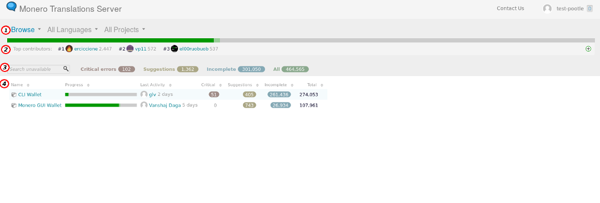
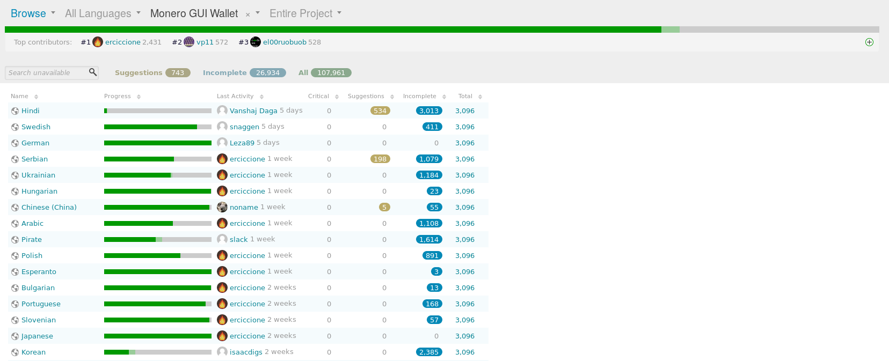
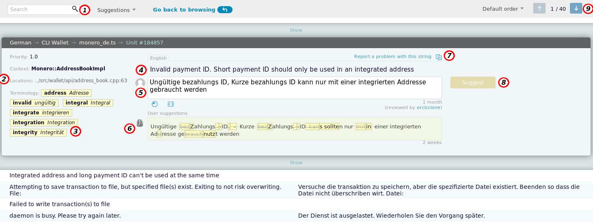

# How to use Pootle, the localization platform
This guide aim to show the basic functionalities of Pootle, how to review/submit translations and to point out common mistakes or known issues.

**Link to Pootle: [translate.getmonero.org/projects](https://translate.getmonero.org/projects)**

For long time we managed Monero translations directly in the code. Translators had to be comfortable using git and other developer-specific tools. Following every single translator step-by-step was very time and energy consuming. **Pootle fixes all this, giving translators the possibility to use an easy graphic interface**, where the contributor only have to submit the translated string.

# How it works
First thing to do is sign up. You can see all the projects, languages and strings without an account, but one it's needed to submit or review translations. If you have other accounts (on reddit, GitHub, GitLab, etc.) **please keep the nickname consistent**, if it's not a privacy issue for you, so that ErCiccione doesn't go crazy if you need to be contacted/credited/whatever.
Once you are logged in, you will se the *Projects* interface.

## Project interface

This page shows the projects available for translation and an assortment of filters.
At the moment is possible to translate the two official Monero wallets: The **CLI** (Command Line Interface) and the **GUI** (Graphical User Interface), but more Monero projects will join soon.

Starting from the top line **(1)** you'll find 3 menu Items:

- **Browse**: if you aren't and administrator you won't see any selectable option.
- **All languages**: filter all projects by language. When one is selected, all statistics shown will be only about that language. Click on the small *x* in the menu to reset the filter.
- **All Projects**: filter by project. It's the same as clicking on a project name.

Below the top menu there is the *Top contributors* menu **(2)**. As the name suggests, you see the top 3 contributors in the last 30 days, but if you click on the green circled '+' on the right you can see many statistics: like the total number of untranslated strings, the list of contributors and the last action on the platform.

We can now collapse the window with the details and check out the menu below **(3)**. This bar contains a lot of useful filters, but **they will be clickable only in the 'Translate' interface**. I will list them briefly, since in the screenshot there are all the possible voices:

- **Search bar**: just a classic search bar, can come very useful when reviewing, i will give some practical suggestions in the next chapters.
- **Critical errors**: number of errors Pootle consider *Critical*. They are usually minor esthetic issues. This filter is set to go very easy on most of the projects, but sometimes it catches something.
- **Suggestons**: number of suggested strings. Basically the amount of strings translated by contributors, but that still need to be reviewed and confirmed.
- **Incomplete**: number of incomplete strings. which includes strings that haven't been translated yet and strings that 'need work'.
- **All** : all strings.

To better understand the last section, **(4)**, click on a project (GUI or CLI), so that all the languages available for that project will show up.
Now you see a list of languages along with many other information and terms we are already familiar with (*critical*, *suggestions*, etc)

From here you can see the progresses of every language, the last contributor, the amounts of errors and of strings that has been suggested, but not reviewed yet. Note that the numbers showed on this page don't match the actual amount of strings. This is a known issue and [has been reported](https://github.com/translate/pootle/issues/6892) on Pootle's repository on GitHub.

## 'Translate' interface

This is the core of Pootle. From here you will submit and review translations. The example screenshot show you a string of the CLI with an already present translation and a suggestion waiting to be reviewed. Let's see what every single part is about:

1. **Search bar**: from here you can search a string or filter them according to their status (suggestions, needs work, untranslated, etc.)
2. **Locations**: this is the path to the original string in the original code.
3. **Terminology**: see more info about the *Terminology* project: [Link](http://docs.translatehouse.org/projects/pootle/en/stable-2.8.x/features/terminology.html)
4. **Source string**: the original string (in English).
5. **Translation submitted in past**.
6. **New suggested translation** waiting for reviews.
7. **Report button**: use it to report a malicious translation or a completely wrong one (that could undermine the comprehensibility of the string).
8. **'Suggest' button**: on Pootle you cannot *submit* new strings, you can suggest them. A reviewer will take a look at your work and confirm/reject it. Your translation will show up as complete once the string is reviewed.
9. **Next string**.

# Ok, but what steps should i practically follow when working on a language?

## Submit translations
Submit a translation is quite easy, just look for the languge you can work on and suggest a new string. All translators must follow these guidelines:

- **Avoid arbitrary changes**: If a translated word/phrase is clear enough it shouldn't be changed, unless it is for a good reason. If you suggest a meaningless change of phrasing, your suggestion will be rejected.
- Please **don't suggest a new translation** if somebody already suggested an acceptable string. I've seen people adding a new suggestion just for a single word, when another valid suggestion was already submitted. This slow down the reviewing process.

- **Some strings can show very small dots in the middle of the line** (see [this example](https://translate.getmonero.org/it/monero-gui/translate/#search=selected&sfields=source,target&unit=163044)). These dots are just spaces, if you see one, you only have to add a space before or after the word/string. In the example you can see a double dot, one at the beginning of the *selected* word and one at the end. Many miss the dot, mistaking it dor dust, please **be sure to check for them on every string**.
- **Some strings will show a black rectangle with the letters 'LF' in it**. That's the equivalent of the *return* button.
- **You must use the Monero terminology guide** if available for your language. This is important to keep all translations as consistent as possible across Monero projects. See if there is a terminology guide for you language [here](https://github.com/monero-ecosystem/monero-translations/tree/master/terminology-guides).
- Please **keep punctuaction consistent** with the source text.

## Review translations
There are cases where you want to **review a string instead of submitting a new one**. This is usually the situation in two cases: you found in the GUI a string translated badly and you want to fix it or you just want to take a look at the language you speak and see if something was mistranslated or can be imporved/made more clear.
Reviews are a very important part of Pootle, a language should never be considere completed, the review process should be constant.

While reviewing, make sure you are following these gidelines:

- Pootle has something called "Fuzzy strings". These strings are marked *need work* by pootle and they have to be considered as *to be checked*. Basically this strings are often translated, but there might be something wrong with them.
- Use the search field **(1)** if you are looking for a specific word/phrase.

# Support and questions
If you have any question or need any help, get in touch with the Localization workgroup, you can find a list of contacts [in the readme of this repository](https://github.com/monero-ecosystem/monero-translations#contacts).
More documentation about Pootle:

https://wiki.documentfoundation.org/PootleGuide
http://docs.translatehouse.org/projects/pootle/en/stable-2.8.x/index.html
