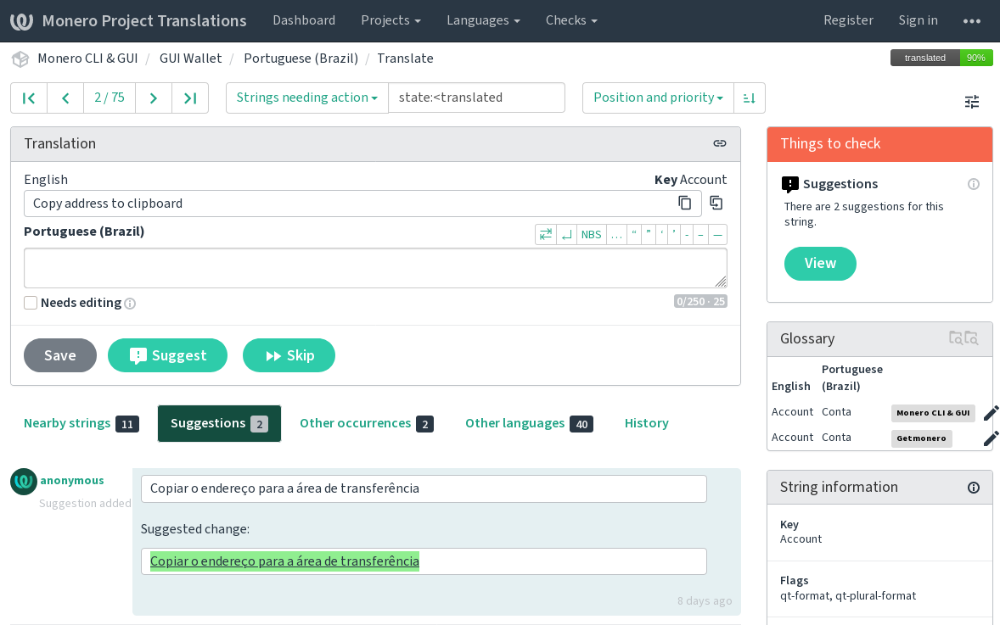

# Translation tips for Monero translators

Thank you for contributing towards helping people use fungible money on the Internet and achieve financial privacy.

The policy of the Monero Project is that we accept any useful contribution if it does not break anything. And maybe we will improve it later if necessary. That is how we have managed to recruit more than 400 contributors. So it is safe to assume that your contribution will be welcome. In some cases, like the getmonero.org website which contains a huge amount of information, it is expected that a translation will not be complete.

Since you may not be a professional translator, this guide will tell you some of the tricks of the trade, to help you create better translations. It also gives some pointers about how to deal with the technology that makes Monero work.

## Contents

1. [How to edit files in Monero projects](#1-how-to-edit-files-in-monero-projects)
2. [People](#2-people)
3. [Consistency](#3-consistency)
4. [Context](#4-context)
5. [Special types of text](#5-special-types-of-text)
6. [English is weird](#6-english-is-weird)
7. [Reference materials](#7-reference-materials)
8. [Spelling and proofreading](#8-spelling-and-proofreading)
9. [Reviewing and testing](#9-reviewing-and-testing)


## 1. How to edit files in Monero projects

The Monero project is a collection of different repositories on GitHub. You can find general information about translation procedures in the [README.md](https://github.com/monero-ecosystem/monero-translations/blob/master/README.md) file.

There you will find specific translation instructions for each project. 


## 2. People

The current system is a marriage of language experts and the software inclined. Do not hesitate to ask to the members of the Localization Workgroup for technical help and planning advice. You find a list of contacts in the README of this repository.

The original version of this guide was written by the Dutch translator Edwin den Boer (@ProkhorZ), who worked as a freelance translator specialized in software localization for 15 years. You may try to contact him for linguistic advice on [Reddit](https://www.reddit.com/user/edbwtf/) or [Twitter](https://twitter.com/edbwt/).

## 3. Consistency

Consistency is even more important than choosing the best translation. For example, a user who wants to know what the view-key does, needs to find the same term that is used in Monero wallets on the Monero website.

Before using dictionaries (see item 7. below), do not forget to search in projects that have already been translated. For example, if you are adding translations to the GUI, look for the existing translations in the [glossary](https://github.com/monero-ecosystem/monero-translations/blob/master/weblate.md#what-is-a-glossary-how-to-use-it) and [translation memory](https://github.com/monero-ecosystem/monero-translations/blob/master/weblate.md#what-is-a-translation-memory-how-to-use-it).

Consistency is not just a matter of terminology. Sticking to a consistent **style**, **grammar** and **spelling** will make the translation look professional and help avoid confusion, even when it means making a random choice between equally valid options. Such choices probably only depend on the target language. For example: Do you use formal pronouns? Which plural form do you use if your language has more than one? Which gender do you use when you are not sure which noun you are referring to? Can it be avoided, or added as variants of the string?

Eventually, each language should have a language-specific style guide and/or adopt a general-purpose style guide from an authoritative source.


## 4. Context

On the other hand, it may be better to translate non-technical terms differently in different contexts. For example, you could use different words for *work* and *working* in the explanation of mining in the GUI:

> Mining secures the Monero network, and also pays a small reward for the work done. (…) It will stop mining when you continue working.

Of course it's important to look at the actual user interface you are translating, but sometimes it helps to go a step further and look at the code.

In the TS translation files, you'll find a reference to a file and a line number for every string. (Note that line numbers may change frequently during development.) This tells you where to find the source code on GitHub—QML code for the GUI, C++ code for the CLI and daemon.

For example, in the GUI, the `%1` placeholder in the string `%1 blocks remaining: ` seemed to refer to a number of blocks. But the [ProgressBar code](https://github.com/monero-project/monero-gui/blob/master/components/ProgressBar.qml) showed that `%1` actually was a string variable, to be filled with the text "Wallet" or "Daemon".

Another important source for finding out what the text actually means is the [Monero StackExchange](https://monero.stackexchange.com/), where technical questions are answered. Do not forget to consult the [Moneropedia](https://getmonero.org/resources/moneropedia/) for definitions of key terms.


## 5. Special types of text

### Step-by-step instructions

When telling the user what to do, mention the required actions in the order they need to be performed. For example: "Click *Save* and enter the filename". It would be confusing to write "Enter the filename after clicking *Save*".

### Untranslatable text

Some parts of the source text should not be translated:
- commands in the command-line interface
- tags in HTML or XML
- code examples in documentation

On the other hand, comments in code examples should be translated. Here is an example from documentation:

```bash
$ brew install cmake boost openssl # Clang installed by default
```

The # is a comment character in Bash, so the text "Clang installed by default" is a comment that should be translated.

When translating text containing code or XML/HTML tags, the safest option is usually to copy the source text in order to keep the tags intact. But make sure you do not accidentally leave part of the source text untranslated.

### Mnemonic seeds

A very special type of text is the word list for mnemonic seeds (the recovery text that encodes your private-key in 25 words). This list is not translated. Versions in other languages than English are created according to certain criteria. The list needs to contain exactly 1626 words. The first part, (the prefix) needs to be unique for every word, so that users can ignore or change the rest of the word. The prefix is 1 character for Chinese, 3 for English, Japanese and Esperanto, and 4 for other languages. You might be able to use an existing word list or corpus in your language as source material. Ideally, the words should also be as common as possible, so that users are able to write them down correctly.

Check the [src/mnemonics](https://github.com/monero-project/monero/tree/master/src/mnemonics) folder in the "monero" repository to see which languages have word lists. You will need help from a developer to add the code necessary to activate the mnemonic seed language. Open an issue in the "monero" repo on GitHub or ask for help on IRC.

Unlike translations, the word list needs to be perfect the first time. When you change it, you could make some users' recovery text invalid. That is why we still support an old list for English.


## 6. English is weird

Please avoid translating literally. Translating means expressing the same meaning in another language — it is more than replacing words.
Ask yourself: If I did not know this text was translated from English, would I notice that it was?

English grammar and style have some peculiarities that you do not need to follow, even in related languages:

- It is not always clear whether a word is a noun or a verb, and when it is a verb; whether it is an infinitive or an imperative. Does *Print* describe the printing process (infinitive), or is it a command or instruction (imperative)? 

> Menu options are usually translated as an infinitive, and instructions to users as an imperative.

- In instructions and especially in marketing copy, the imperative may imply 'for your convenience'. For example: "On Linux systems, use Snapcraft for easy deployment." In that case, I would prefer to use the equivalent of 'you can' in the translation.

- English speakers like to joke about the length of compound words in German, but compound nouns can be just as long in English. They are just less noticeable, because the parts are written as separate words. In your translation, you may have to make the relation between words more explicit by adding prepositions. So you will have to understand what it means! For example, *failed password security question answer attempts limit* could be explained as a *limit on the number of answer attempts for security questions after failed passwords*. Note that the first part of a compound will often hide a plural: a *transaction counter* will count multiple transactions.

- *All Words In Titles Start With Uppercase Letters.* This is not the preferred style in many other languages that use an alphabet.

When your translation is longer than the English text, some of these peculiarities may have the side-effect of making the translation shorter without losing any information:

- Quantifiers like 'some' and 'any' in the previous sentence are not needed in many languages.

- Subclauses can be short in English and they are used more often than in other languages. But they can lead to complex layers of statements that are hard to parse. Simplify the translation by splitting sentences or by replacing a subclause with a preposition: *that contains* becomes *with*.

- General categories are often mentioned explicitly where they would be implied in other languages: depending on the context, *the getmonero.org website* could be simply called *getmonero.org* in your translation.

- Double negatives are popular in English. Try avoiding confusion by turning them into positive statements: *Don't do this unless…* = *Only do this if…*


## 7. Reference materials

Professional translators search for everything - especially simple words like *set* that have hundreds of different meanings. When deciding which word to use in the translation, knowing what the source text means is just the first step.

Translation memories and terminology databases are more useful sources than dictionaries. In translation memories, you can see how a term is translated in a particular context. A good terminology database will also include contextual information such as definitions, longer strings and a label for the product.

Luckily, there are plenty of reference sources available on the Internet. But take into account that the source might use a term in a different way than Monero developers do.

* The [Microsoft Language Portal](https://www.microsoft.com/Language/en-US/Search.aspx) offers an extensive terminology database for the many languages Microsoft products have been translated in. There is no freely available equivalent for iOS or macOS. If you are looking for an Apple-specific term, your best bet is to search apple.com and then to change the language code on the page you find.

* [Linguee](http://www.linguee.com/) is an online dictionary that displays examples and definitions from multilingual websites. Linguee offers translations between all official EU languages except Irish, as well as between English and Chinese, Russian and Japanese. It is very user-friendly: you can enter a word from the source or target language without explicitly changing the direction.

For difficult terms, other options include:

* [TAUS data](http://www.tausdata.org/), a collection of translation memories with a wider selection of languages than Linguee.

* [IATE](http://iate.europa.eu/), the European Union's multilingual termbase, compiled from various technical dictionaries and termbases.

* Searching on [Wikipedia](https://en.wikipedia.org/wiki/Main_Page) and changing the language may help you find an explanation as well as an accompanying translation.

* Of course, you could use a search engine like [DuckDuckGo](https://duckduckgo.com/) or [StartPage](https://www.startpage.com/) to find the meaning of a term, or to check which translation is used more often.

* The official Monero Channels: some terms specific to cryptocurrencies can be difficult to translate correctly. Feel free to ask in our chats like #monero-translations, #monero, or #monero-community, somebody will gladly help you.

Using Google Translate for anything but checking single words is against their terms and policy, and bad practice at that.



## 8. Spelling and proofreading

Did you finish the translation? Congratulations! Now it is time to check the spelling manually as well as automatically, again. This may require pasting the text into a browser, text editor or word processor. Take into account that spell checkers are bad at applying rules for compounding. A red squiggle is a warning, not necessarily an error. And on the other hand, spell checkers will not always notice misspellings that happen to be correct words, like *pubic key*.

Do not use search engines to check the spelling! The most common errors might be more popular than the correct spelling. Or you might find more hits for "you're right" than "your right" when you are trying to spell "on your right".

It is also useful to check for double spaces, double periods, spaces before punctuation etc. Weblate does a few automated checks, like checking whether the punctuation at the end of a string is the same as in the source text.

For long-form text like a web page, people used to print the text to read more carefully and catch errors. That method might be outdated. The modern equivalent would be having a text-to-speech app read it out loud. The app will struggle with typos that your brain might correct automatically.


## 9. Reviewing and testing

The best practice would be to compile and test the translated version of the software before submitting a pull request. If you are not able to do this, maybe you can find someone who can?

Actually use your translations. Please do not think: "I don't need it, I speak English."

Translations are reviewed by volunteers on GitHub and Weblate before being merged. If you do not have time to translate, please consider reviewing the translations of others.

Don't worry about failed building checks on GitHub; it may happen that the code in the "master" branch won't compile correctly while it is being updated. This can be caused by reasons not related to your translation. If in doubt, ask in the chatrooms.


